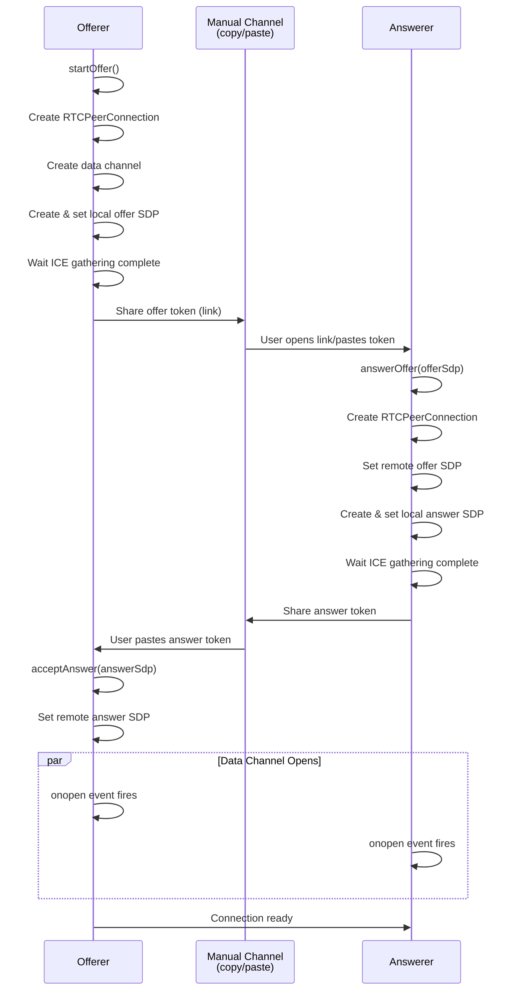
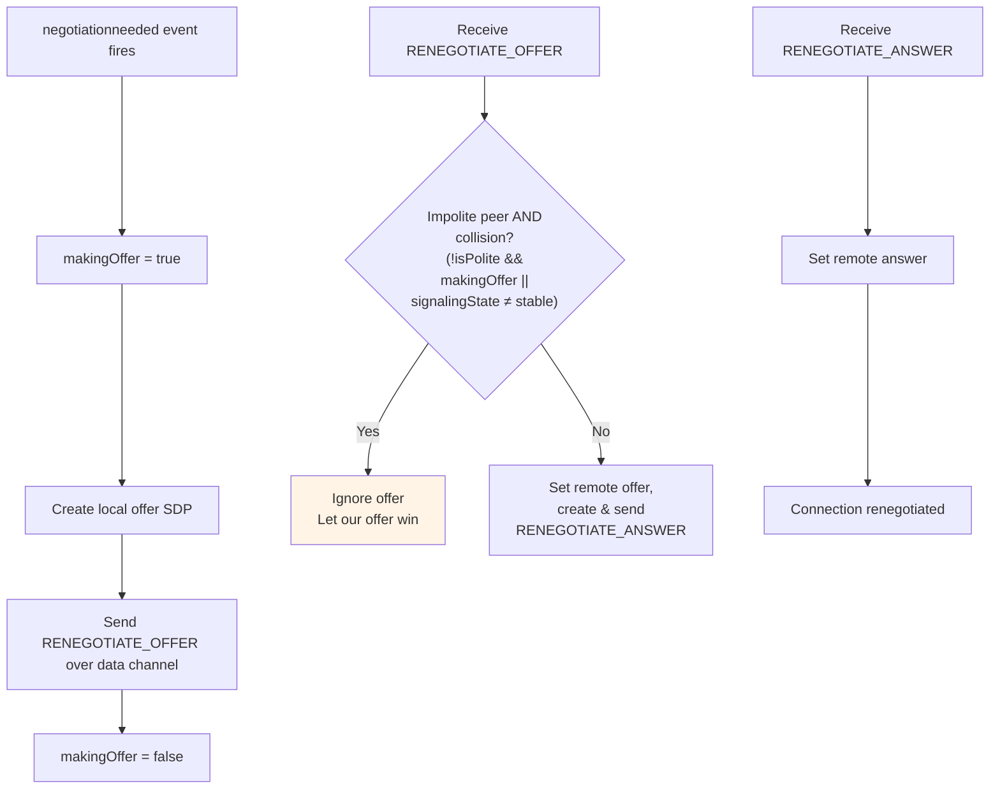
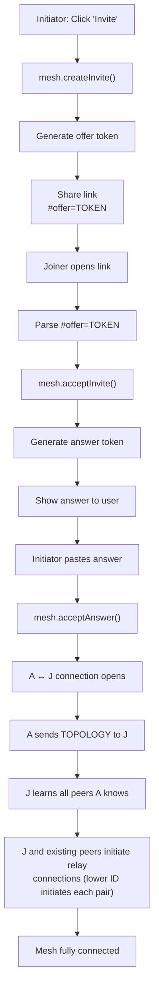
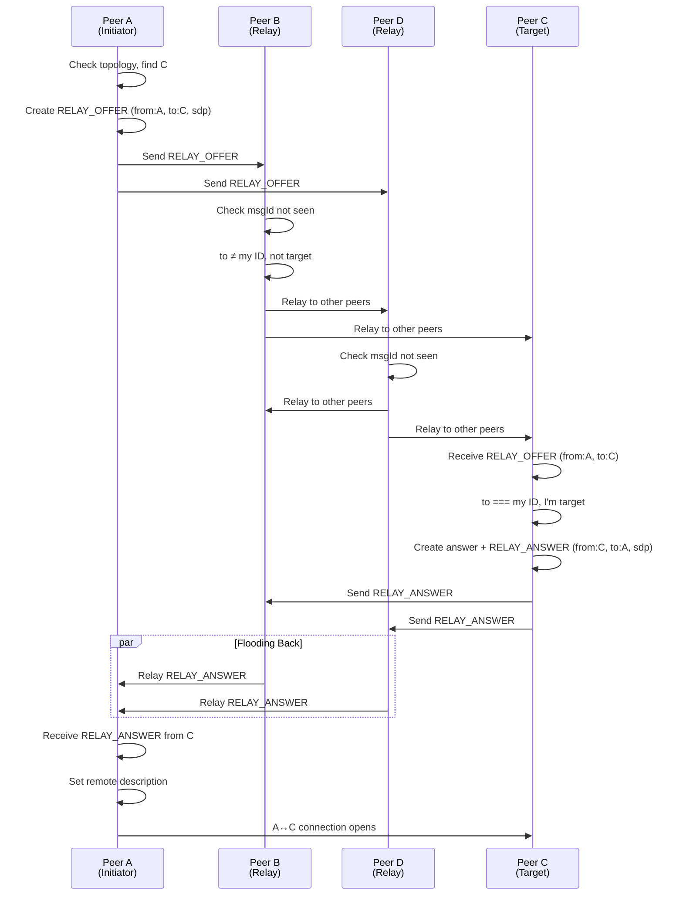
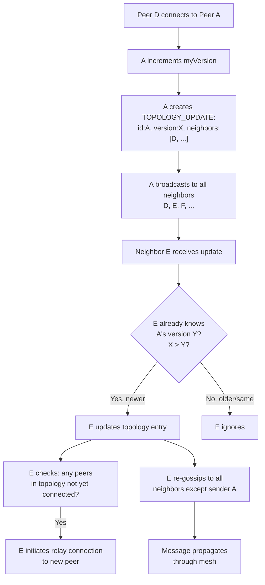
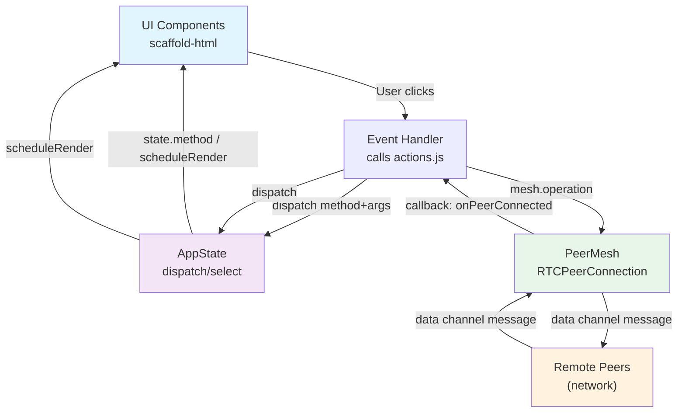

# Architecture Document

Serverless peer-to-peer video conferencing. Full-mesh topology with manual token exchange for initial connection. Public STUN servers only; no central signaling server.

## State Management

### AppState Structure
- **Identity**: `myId` (UUID), `myName` (string)
- **Peers**: Map of connected peers with current names and media streams
- **Modals**: `invitePhase` (idle/offering/waiting-answer), `joinPhase` (idle/processing/showing-answer), `settingsOpen`, `chatOpen`
- **Media**: `localStream`, `audioEnabled`, `videoEnabled`, `screenShareActive`, device lists, selected devices
- **UI State**: `pinnedPeerId`, chat messages, error messages

### State Updates
- Components dispatch actions via global `dispatch(method, ...args)` function
- State methods update AppState directly and call `scheduleRender()`
- Render scheduled via microtask to batch updates
- UI components re-render by calling `App(state)` with current state

---

## Peer Connection State Machine

### Initial Connection (Offer/Answer Handshake)

### Renegotiation (Track Changes)

When media tracks are added or replaced after connection is established, perfect negotiation pattern prevents collision:

Key insight: By assigning "polite" role to the answerer, simultaneous offers are resolved deterministically — the impolite peer (offerer) ignores incoming offers during a collision and waits for an answer to its own offer; the polite peer always yields.

---

## Mesh Formation (Gossip Protocol)

### Topology Model
Each peer maintains a distributed replica of the mesh topology:
- **Topology**: Map of peer ID → `TopologyEntry`
- **TopologyEntry**: `{id, name, version, neighbors: [peerIds]}`
- **Version**: Incremented each time a peer's neighbor set changes
- **Authority**: Each peer is authoritative for its own entry; remote entries accepted if version > local version (last-write-wins)

### Bootstrap: Invite/Join Flow

### Mesh Formation: Relay Connections

Once peers learn about each other via gossip:

**Deduplication:** Each relay message has a `msgId` (UUID). Seen-set (bounded to 500 entries) prevents re-processing messages that loop back.

**Offer Collision Prevention:** Peer with lexicographically lower ID initiates the relay offer. This ensures only one side sends an offer, preventing simultaneous offer situations.

### Topology Gossip

**When a peer connects or disconnects:**

**Anti-Entropy (Healing):**
- Every 30 seconds (starts after first peer connects): sends a full `TOPOLOGY` snapshot to all neighbors, prunes departed peers, and retries missing connections
- Receivers merge the snapshot and fan out anything they were missing, so it heals third-party divergence, not just this peer's own entry
- Recovers from message loss that may have silently dropped topology updates

**Relay timeout & retry:**
- Each outgoing relay offer has a timeout (20s); on expiry the attempt is cancelled and retried, up to 3 attempts (reset when the target gossips a newer entry)
- `RELAY_ANSWER` carries `replyTo` (the offer's `msgId`); answers to abandoned offers are ignored so a late answer can't corrupt a newer attempt

**Departed-peer pruning:**
- A peer's own topology entry can only be updated by its owner, so entries of departed peers linger
- Entries with no mutual-edge path from this peer (both sides list each other) are marked unreachable; if still unreachable after a 90s grace period they are pruned
- The grace period covers transient asymmetry while gossip converges (e.g. a joining peer's entry arriving before its neighbor's updated entry)

---

## Message Types

All messages are JSON strings sent over data channels.

**Topology Management:**
- `TOPOLOGY`: Full mesh state sync (sent once to new peer)
- `TOPOLOGY_UPDATE`: Single entry update (gossiped through mesh)

**Relay Signaling:**
- `RELAY_OFFER`: Offer for new connection, flooded to destination (`msgId` for dedup)
- `RELAY_ANSWER`: Answer response, flooded back (`replyTo` = the offer's `msgId`, so stale answers are ignored)

**Renegotiation (during existing connection):**
- `RENEGOTIATE_OFFER`: SDP offer for track changes
- `RENEGOTIATE_ANSWER`: SDP answer for track changes

**Application Messages:**
- `PEER_META`: Name change broadcast
- `CHAT`: Chat message with text and timestamp
- `SCREEN_SHARE`: Screen share active/inactive notification

---

## UI ↔ State ↔ Mesh Data Flow

**UI → State → Mesh:** Actions in `actions.js` coordinate state dispatch and mesh operations. State updates always happen first (optimistic UI); mesh broadcasts are side effects.

**Mesh → State → UI:** Mesh callbacks always trigger `dispatch()`. UI automatically reflects state via the re-render loop — no imperative DOM manipulation.

**Track replacement** reuses the same MediaStream and stream ID, so video elements automatically display the new track without re-binding.

---

## Key Design Decisions

1. **No Central Server:** Topology is gossiped peer-to-peer. Each peer maintains full replica.

2. **Manual Token Exchange:** Initial connection uses copy/paste tokens instead of server. Scalable to any number of peers without central bottleneck.

3. **Last-Write-Wins Topology:** Version number ensures eventual consistency without coordination.

4. **Perfect Negotiation Pattern:** Prevents both sides from sending offers simultaneously during renegotiation.

5. **Deduplication by msgId:** Flooded relay messages are deduplicated with bounded O(1) seen-set.

6. **Bounded Anti-Entropy:** 30-second re-gossip recovers from message loss without continuous overhead.

7. **Lexicographic Tie-Breaking:** Lower peer ID initiates relay offer to prevent duplicate offers.

8. **Unidirectional Data Flow:** UI → State → Mesh (actions dispatch state changes, state changes trigger mesh operations). Mesh → State → UI (mesh callbacks dispatch state changes, UI re-renders).

9. **Render Scheduling:** Microtask-based batching prevents excessive re-renders during async operations.

10. **Renegotiation via Data Channel:** Uses out-of-band SDP messages over existing data channel instead of ICE candidates for simplicity.
