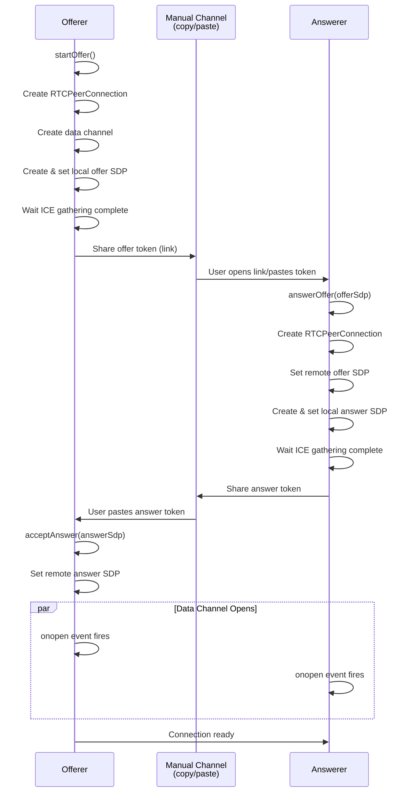
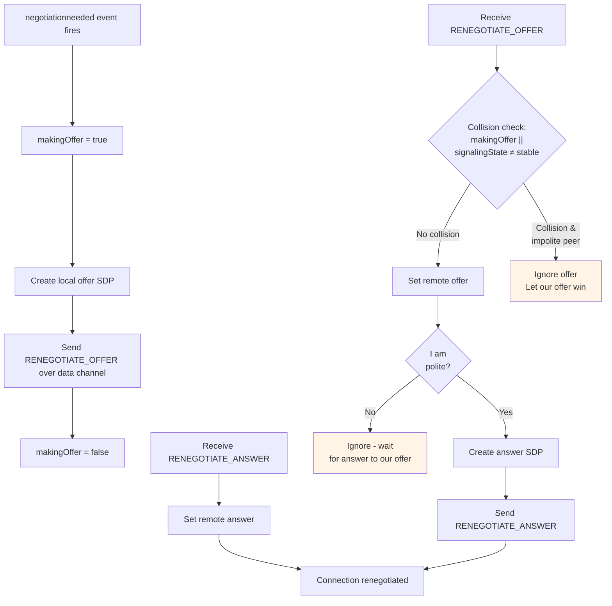
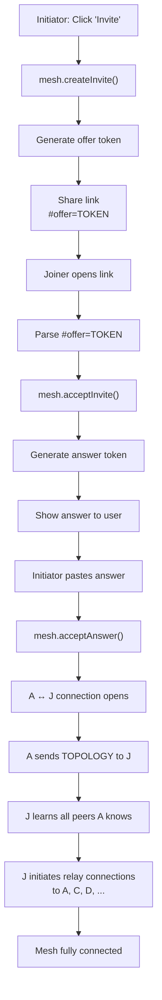
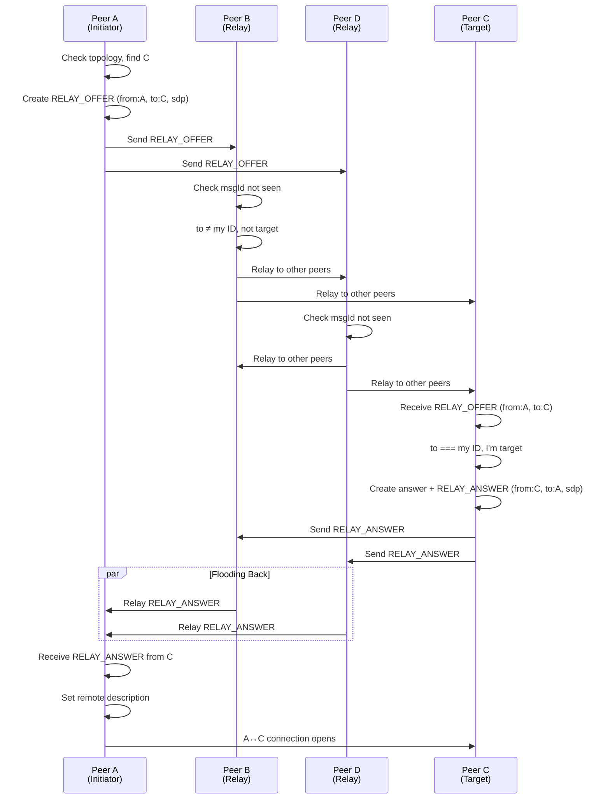
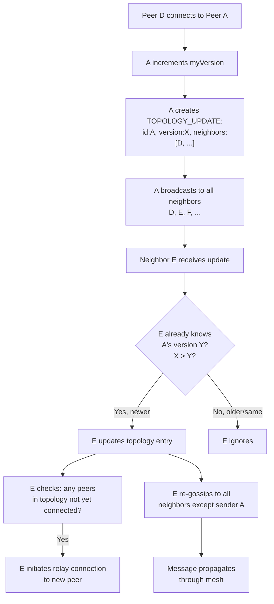
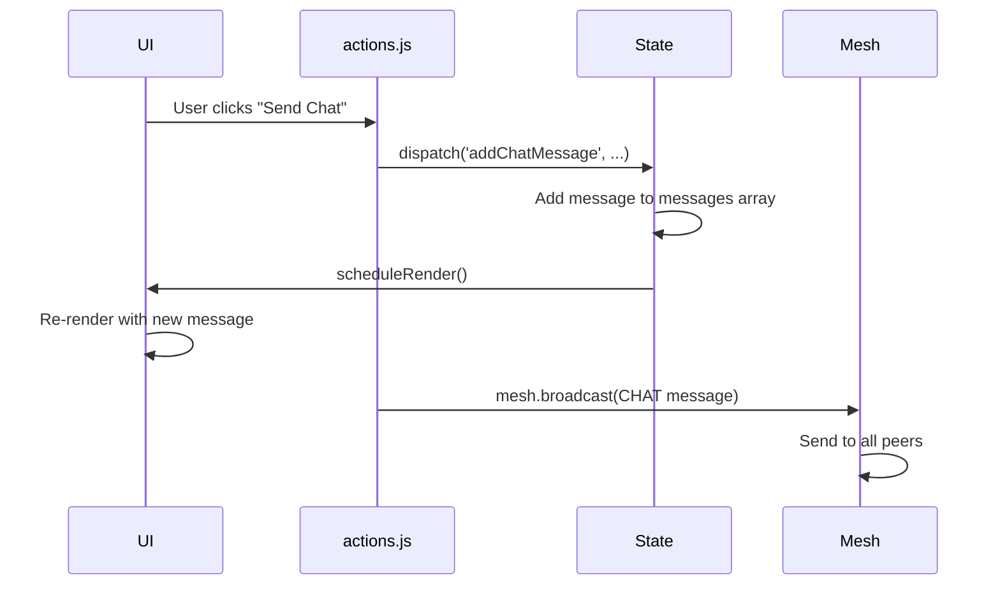
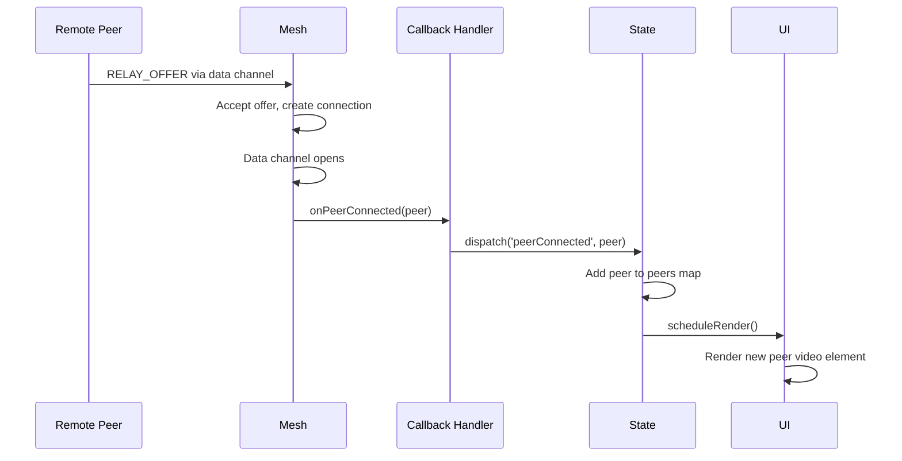
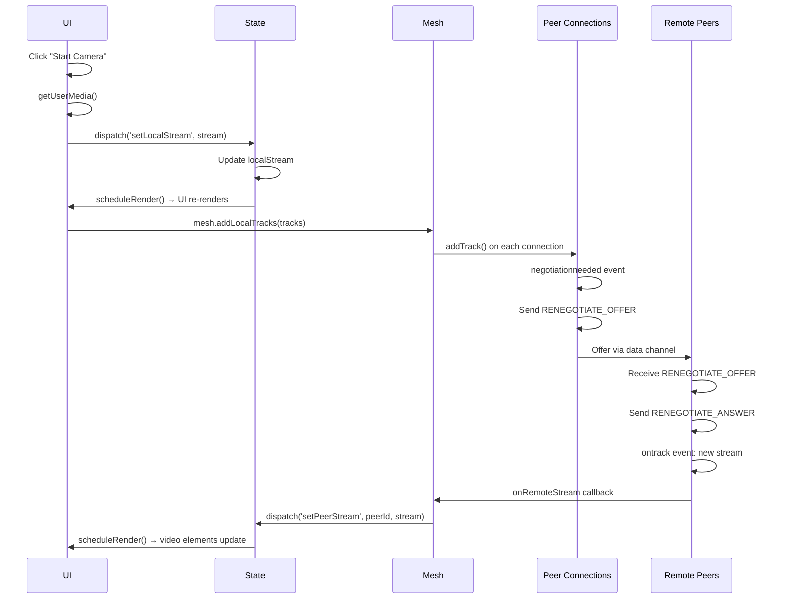
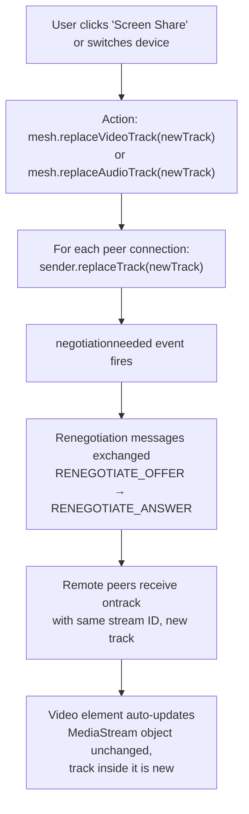

# Architecture Document

Serverless peer-to-peer video conferencing. Full-mesh topology with manual token exchange for initial connection. Public STUN servers only; no central signaling server.

## State Management

### AppState Structure
- **Identity**: `myId` (UUID), `myName` (string)
- **Peers**: Map of connected peers with current names and media streams
- **Modals**: `invitePhase` (idle/offering/waiting-answer), `joinPhase` (idle/processing/showing-answer), `settingsOpen`, `chatOpen`
- **Media**: `localStream`, `audioEnabled`, `videoEnabled`, `screenShareActive`, device lists, selected devices
- **UI State**: `pinnedPeerId`, chat messages, error messages

### State Updates
- Components dispatch actions via global `dispatch(method, ...args)` function
- State methods update AppState directly and call `scheduleRender()`
- Render scheduled via microtask to batch updates
- UI components re-render by calling `App(state)` with current state

---

## Peer Connection State Machine

### Initial Connection (Offer/Answer Handshake)



### Data Channel Lifecycle
- **Offerer**: Creates data channel during `pc.createOffer()`
- **Answerer**: Receives data channel via `pc.ondatachannel` event
- **Open**: Connection ready when `readyState === 'open'`
- **Close**: Triggered by peer disconnect; fires `onDisconnected` callback

### Renegotiation (Track Changes)

When media tracks are added or replaced after connection is established, perfect negotiation pattern prevents collision:



Key insight: By assigning "polite" role (answerer initiates connection), simultaneous offers are resolved deterministically — the impolite peer backs down and waits for an answer to its offer.

---

## Mesh Formation (Gossip Protocol)

### Topology Model
Each peer maintains a distributed replica of the mesh topology:
- **Topology**: Map of peer ID → `TopologyEntry`
- **TopologyEntry**: `{id, name, version, neighbors: [peerIds]}`
- **Version**: Incremented each time a peer's neighbor set changes
- **Authority**: Each peer is authoritative for its own entry; remote entries accepted if version > local version (last-write-wins)

### Bootstrap: Invite/Join Flow

**High-level flow:**



**Detailed flow:**

**Initiator (creates invite link):**
1. Call `mesh.createInvite(myId, myName)`
   - Create RTCPeerConnection + offer
   - Return shareable link with base64-encoded offer token
   - Return `acceptAnswer(answerToken)` callback

2. User copies link to joiner

**Joiner (accepts invite link):**
1. Parse `#offer=BASE64` from URL
2. Call `mesh.acceptInvite(offerInput, myId, myName)`
   - Create RTCPeerConnection from offer SDP
   - Generate answer SDP
   - Begin connection asynchronously (fires `onPeerConnected` when data channel opens)
   - Return answer token to user

3. User copies answer token back to initiator

**Initiator continues:**
1. User pastes answer token
2. Call `acceptAnswer(answerToken)`
   - Set remote description (answer)
   - Connection completes immediately (data channel already created on offerer side)

**First connection established:**
1. Initiator's mesh sends new peer its full topology via `TOPOLOGY` message
2. New peer merges topology entries
3. New peer initiates relay connections to all peers it learned about

### Mesh Formation: Relay Connections

Once peers learn about each other via gossip:



**Flow details:**
- A creates offer and floods to all neighbors (B, D)
- Each relay peer (B, D) forwards to others (except sender) — this spreads the message through the mesh
- C receives the offer (via B or D), recognizes `to === myId`, and processes it
- C sends answer back via same flooding mechanism
- A receives the answer and completes the connection

**Deduplication:** Each relay message has a `msgId` (UUID). Seen-set (bounded to 500 entries) prevents re-processing messages that loop back.

**Offer Collision Prevention:** Peer with lexicographically lower ID initiates the relay offer. This ensures only one side sends an offer, preventing simultaneous offer situations.

### Topology Gossip

**When a peer connects or disconnects:**



**Anti-Entropy (Healing):**
- Automatic re-gossip every 30 seconds (starts after first peer connects)
- Sends full `TOPOLOGY_UPDATE` of this peer's entry to all neighbors
- Recovers from message loss that may have silently dropped topology updates

**State Tracking:**
- Maintaining full topology allows decision-making about who should initiate relay connections
- Prevents duplicate connection attempts between same two peers (lexicographic tie-breaking: lower ID initiates)

---

## Message Types

All messages are JSON strings sent over data channels.

**Topology Management:**
- `TOPOLOGY`: Full mesh state sync (sent once to new peer)
- `TOPOLOGY_UPDATE`: Single entry update (gossiped through mesh)

**Relay Signaling:**
- `RELAY_OFFER`: Offer for new connection, flooded to destination
- `RELAY_ANSWER`: Answer response, flooded to sender

**Renegotiation (during existing connection):**
- `RENEGOTIATE_OFFER`: SDP offer for track changes
- `RENEGOTIATE_ANSWER`: SDP answer for track changes

**Application Messages:**
- `PEER_META`: Name change broadcast
- `CHAT`: Chat message with text and timestamp
- `SCREEN_SHARE`: Screen share active/inactive notification
- `PEER_LEFT`: Graceful disconnect signal

---

## UI ↔ State ↔ Mesh Data Flow

**Architecture overview:**

```mermaid
flowchart TB
    UI["UI Components<br/>scaffold-html"]
    State["AppState<br/>dispatch/select"]
    Mesh["PeerMesh<br/>RTCPeerConnection"]
    RemotePeers["Remote Peers<br/>(network)"]

    UI -->|User clicks| Handler["Event Handler<br/>calls actions.js"]
    Handler -->|dispatch<br/>method, args| State
    State -->|state.method()<br/>scheduleRender| UI
    Handler -->|mesh.operation| Mesh

    Mesh -->|data channel<br/>message| RemotePeers
    RemotePeers -->|data channel<br/>message| Mesh
    Mesh -->|callback:<br/>onPeerConnected| Handler
    Handler -->|dispatch| State
    State -->|scheduleRender| UI

    style UI fill:#e1f5ff
    style State fill:#f3e5f5
    style Mesh fill:#e8f5e9
    style RemotePeers fill:#fff3e0
```

### Unidirectional Flow: UI → State → Mesh

**User Action → State Change → Mesh Action:**



**Pattern:** Actions in `actions.js` coordinate state dispatch + mesh operations. State updates always happen first; mesh broadcasts are side effects. This ensures optimistic UI updates.

### Unidirectional Flow: Mesh → State → UI

**Mesh Event → State Change → UI Re-render:**



**Pattern:** Mesh callbacks always trigger `dispatch()`. UI automatically reflects state via re-render loop. No imperative DOM manipulation.

### Media Track Lifecycle

**Adding Tracks (starts camera):**



**Replacing Tracks (switch device or screen share):**



Key insight: Track replacement reuses the same MediaStream and stream ID, so video elements automatically display the new track without needing to re-bind.

---

## State Machines by Feature

### Invite Flow (Initiator)

```mermaid
stateDiagram-v2
    [*] --> idle

    idle -->|startInvite()| offering
    offering -->|error| idle: setInviteError()
    offering -->|offer created| waiting-answer: setOfferReady(link)
    waiting-answer -->|acceptAnswer()| idle: connection established
    waiting-answer -->|cancelInvite()| idle
    waiting-answer -->|error| idle: setInviteError()

    idle --> [*]
```

### Join Flow (Joiner)

```mermaid
stateDiagram-v2
    [*] --> idle

    idle -->|handleOffer(token)| processing
    processing -->|error| idle: setJoinError()
    processing -->|answer created| showing-answer: setAnswerToken()
    showing-answer -->|user confirms| idle: answer sent, awaiting connection
    showing-answer -->|error| idle: setJoinError()
    showing-answer -->|peerConnected callback| idle: auto-close when mesh ready

    idle --> [*]
```

### Media State
```
localStream: null → getUserMedia() → MediaStream with tracks
  → addLocalTracks() to mesh → renegotiation → remote peers receive

screenShareActive: false → startScreenShare() → true
  → replaceVideoTrack(screenTrack) → renegotiation
  → stopScreenShare() → false
  → replaceVideoTrack(cameraTrack) → renegotiation
```

---

## Key Design Decisions

1. **No Central Server:** Topology is gossiped peer-to-peer. Each peer maintains full replica.

2. **Manual Token Exchange:** Initial connection uses copy/paste tokens instead of server. Scalable to any number of peers without central bottleneck.

3. **Last-Write-Wins Topology:** Version number ensures eventual consistency without coordination.

4. **Perfect Negotiation Pattern:** Prevents both sides from sending offers simultaneously during renegotiation.

5. **Deduplication by msgId:** Flooded relay messages are deduplicated with bounded O(1) seen-set.

6. **Bounded Anti-Entropy:** 30-second re-gossip recovers from message loss without continuous overhead.

7. **Lexicographic Tie-Breaking:** Lower peer ID initiates relay offer to prevent duplicate offers.

8. **Unidirectional Data Flow:** UI → State → Mesh (actions dispatch state changes, state changes trigger mesh operations). Mesh → State → UI (mesh callbacks dispatch state changes, UI re-renders).

9. **Render Scheduling:** Microtask-based batching prevents excessive re-renders during async operations.

10. **Renegotiation via Data Channel:** Uses out-of-band SDP messages over existing data channel instead of ICE candidates for simplicity.
